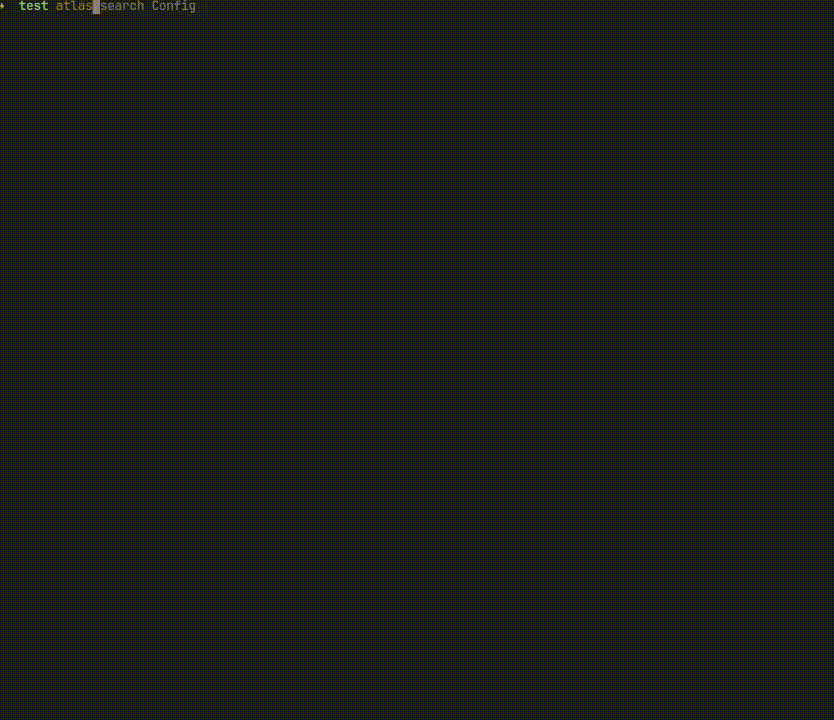

# Atlas - Project-Scoped Codebase Indexer & Search Tool

Atlas is a fast, local CLI tool designed to index your Python projects. It uses Python's Abstract Syntax Tree (AST) to parse source code making it significantly faster and more accurate than regex-based searching. It allows you to instantly locate classes, functions and methods across your project



---

## Features

- **AST-Powered Parsing:** parses source code logic rather than raw text, eliminating false positives
- **Incremental Indexing:** tracks file changes using `md5` hashes, subsequent runs are near-instant as they only process modified files
- **Flexible Search:** supports both exact and fuzzy matching
- **Git Integration:** automatically respects your project's `.gitignore` rules to avoid indexing build artifacts or virtual environments
- **Rich UI:** resuls are presented in a beautiful, structured file tree using `Rich` library

---

## Installation

### Linux & macOS
For `x86_64` systems, you can install `atlas` directly using the installation script. This will automatically detect your OS, download the latest release and move it to `/usr/local/bin`
```bash
curl -fsSL https://raw.githubusercontent.com/neuroquarkk/atlas/main/install.sh | bash
```

### Setup from source

1. Clone the repository:

```bash
git clone https://github.com/neuroquarkk/atlas.git
cd atlas
```

2. Install dependencies:

```bash
uv sync
```

3. Compile:

```bash
pyinstaller --onefile --name atlas --paths src --optimize 1 --clean main.py
```

---

## Usage

| What you want to do    | Command                    | Notes                              |
| ---------------------- | -------------------------- | ---------------------------------- |
| Initialize Atlas       | `atlas init`               | Run once per project               |
| Index your code        | `atlas index`              | Fast, incremental by default       |
| Rebuild the index      | `atlas index --fresh`      | Optional, rarely needed            |
| Search by exact name   | `atlas search MyClassName` | Best when you know the symbol      |
| Search by partial name | `atlas search -p Config`   | Fuzzy matching                     |
| Check index status     | `atlas status`             | See changed, deleted, or new files |

---
